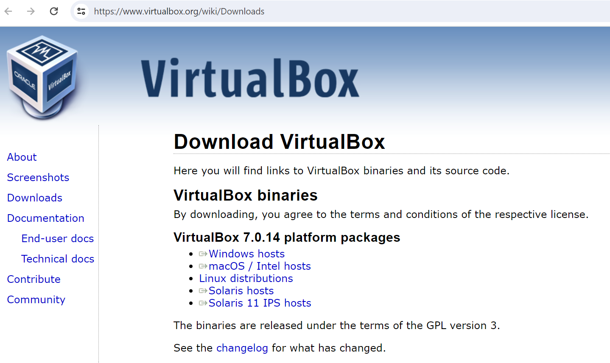
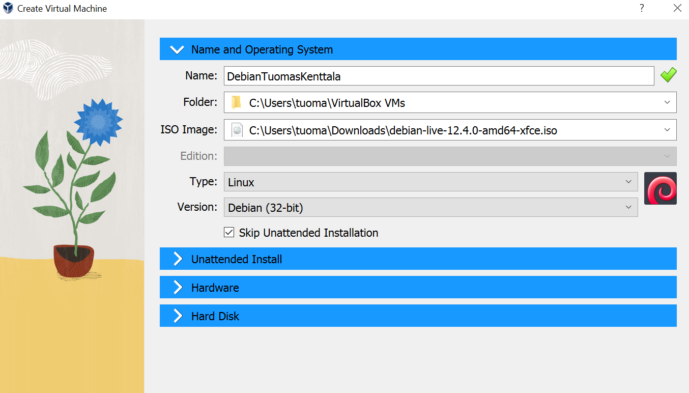

# H1 Oma Linux

## Vapaa ohjelmisto

Vapaa ohjelmisto viittaa ohjelmistoon, mikä antaa käyttäjälleen vapaat kädet soveltaa, muokata ja jakaa kyseistä ohjelmistoa. Vapaalla ohjelmistolla on neljä määrittelevää ominaisuutta:
 - Vapaus käyttää ohjelmistoa miten haluaa ja mihin tarkoitukseen tahansa.
 - Vapaus pystyä tutustumaan ja muokkaamaan ohjelmiston koodia kokonaisuudessaan.
 - Vapaus jakaa ohjelmistoa muille.
 - Vapaus jakaa itse muokkaamaansa versiota ohjelmistosta muille.

Vapaa ohjelmisto ei sulje pois taloudellisen hyödyn saamista kyseisellä ohjelmistolla tai siitä johdetuilla tuotteilla. Taloudellinen hyöty ei ole määrittelevä tekijä suuntaan taikka toiseen kun puhutaan siitä mikä on vapaa ohjelmisto ja mikä ei.

## Debianin asennus virtuaalikoneeseen

Aluksi latasin VirtualBox-ohjelmiston työkoneelleni (windows 11)

Onnistuneen VirtualBox-ohjelmiston asentamisen jälkeen loin virtuaalikoneen, johon mounttasin Debianin (versio  debian-live-12.4.0-amd64-xfce).

