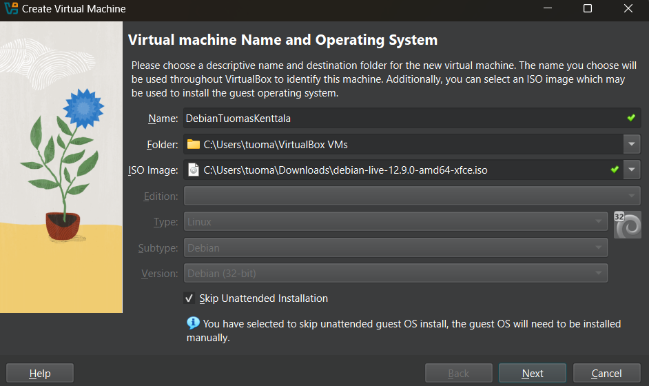
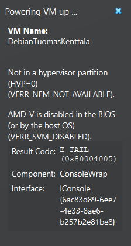
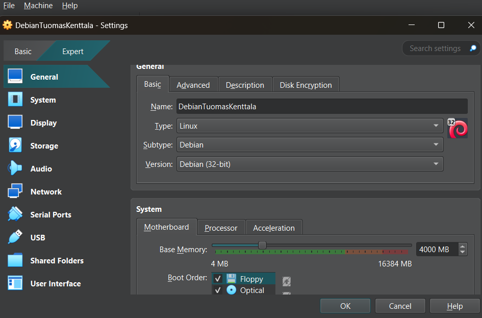

# H1 Oma Linux

## Vapaa ohjelmisto

Vapaa ohjelmisto viittaa ohjelmistoon, mikä antaa käyttäjälleen vapaat kädet soveltaa, muokata ja jakaa kyseistä ohjelmistoa. Vapaalla ohjelmistolla on neljä määrittelevää ominaisuutta:
 - Vapaus käyttää ohjelmistoa miten haluaa ja mihin tarkoitukseen tahansa.
 - Vapaus pystyä tutustumaan ja muokkaamaan ohjelmiston koodia kokonaisuudessaan.
 - Vapaus jakaa ohjelmistoa muille.
 - Vapaus jakaa itse muokkaamaansa versiota ohjelmistosta muille.

Vapaa ohjelmisto ei sulje pois taloudellisen hyödyn saamista kyseisellä ohjelmistolla tai siitä johdetuilla tuotteilla, eli vapaa ohjelmisto =/= ilmaisohjelma. Taloudellinen hyöty ei ole määrittelevä tekijä suuntaan taikka toiseen kun puhutaan siitä mikä on vapaa ohjelmisto ja mikä ei.

## Debianin asennus virtuaalikoneeseen

Aluksi latasin VirtualBox-ohjelmiston koneelleni osoitteesta https://www.virtualbox.org/wiki/Downloads. Tiedostotyypin valitsin kohdasta "Windows Hosts" ja versio oli VirtualBox-7.1.4-165100-Win.
Yrittäessäni asentaa Virtualbox-ohjelmaa sain kuitenkin virheilmoituksen (kuva 1). Korjasin ongelman lataamalla uusimman Microsoft Visual C++ Redistributable Version osoitteesta https://learn.microsoft.com/en-us/cpp/windows/latest-supported-vc-redist?view=msvc-170. Asennetun kirjaston versio oli Microsoft Visual C++ 2015-2022 Redistributable (x64) - 14.42.34433.

Onnistuneen VirtualBox-ohjelmiston asentamisen jälkeen loin virtuaalikoneen, johon mounttasin Debianin (versio debian-live-12.9.0-amd64-xfce, jonka latasin osoitteesta https://cdimage.debian.org/debian-cd/current-live/amd64/iso-hybrid/ ). Asennuksessa käytin Tero Karvisen 2021, Debianin asennusohjeita (https://terokarvinen.com/2021/install-debian-on-virtualbox/ ).

Käynnistäessä näin luotua virtuaalikonetta kohtasin kuitenkin seuraavanlaisen virheilmoituksen:

Korjasin ongelman seuraavin askelin: 1) käynnistin isäntäkoneen uudelleen ja menin BIOS-asetuksiin. 2) Sieltä etsin järjestelmä asetukset -lehdeltä kohdan "Enable VMS" ja aktivoin sen. 3) Käynnistin koneen normaalisti. 
Ongelma oli siis, että virtuaaliympäristöjä ei ollut lähtökohtaisesti sallittu koneeni asetuksissa ja näillä toimilla kävin manuaalisesti sallimassa ne. 

Tämän jälkeen yritin uudelleen käynnistää virtuaalikoneen, joka onnistui tällä kertaa ongelmitta. Tämän jälkeen suoritin Debianin asennusohjelman, jossa tuli kuitenkin ongelma debianin version yhteensopivuuden kanssa. Tämän korjasin käymällä manuaalisesti Virtualboxissa virtuaalikoneen asetuksissa vaihtamassa käytetyn version 32-bittisestä 64-bittiseen.  

 Testasin vielä perustoimintoja virtuaalikoneessa ja en kohdannut vajavaisuuksia.

