# H2 Komentaja Pingviini

## x)

Muutamia avainkohtia Tero Karvisen artikkelista https://terokarvinen.com/2020/command-line-basics-revisited/?fromSearch=command%20line%20basics%20revisited. 
- Hakemistopuussa liikkuminen tapahtuu komennolla "cd", jonka perään pistetään kohdehakemisto TAI "..", jolla pääsee siirtymään yhden hakemiston ylöspäin hakemistopuussa.
- Hallittaessa tiedostoja ja kansioita on hyvä muistaa, että linuxissa harvoin komentoa ajaessa tulee varmistuspromptia. Eli pitää olla varovainen, että ei vahingossa tee peruuttamattomia muutoksia ajaessaan komentoja.
- Komennoista saa lisätietoa manuaali-komennolla "man". Lisäksi monissa komennoissa on help-lisätoiminto (--help tai -h).

## a)

Asensin Micro-editorin seuraavilla komennoilla:

    $ sudo apt-get update
    $ sudo apt-get -y install micro

Asennus onnistui ongelmitta.

## b)

Uusien komentoriviohjelmien asennus. Aluksi tutustuin tarjontaan komennolla:

    $ apt-cache search text user interface

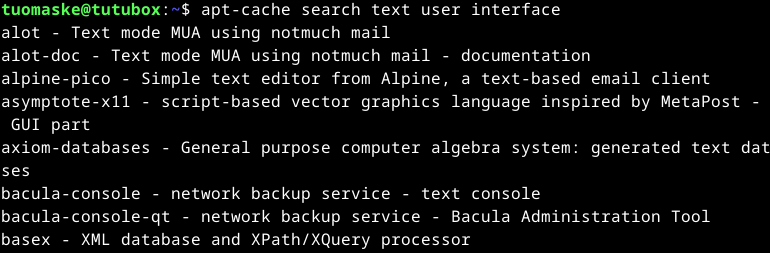

Listauksesta valitsin ohjelmat "Searchmonkey" ja "pspp". Kolmanneksi ohjelmaksi valitsin pelin Nethack. Asensin nämä ohjelmat komennolla

    $ sudo apt-get -y install searchmonkey pspp nethack-console

Seuraavaksi testasin, että jokainen näistä asennetuista ohjelmista toimii.

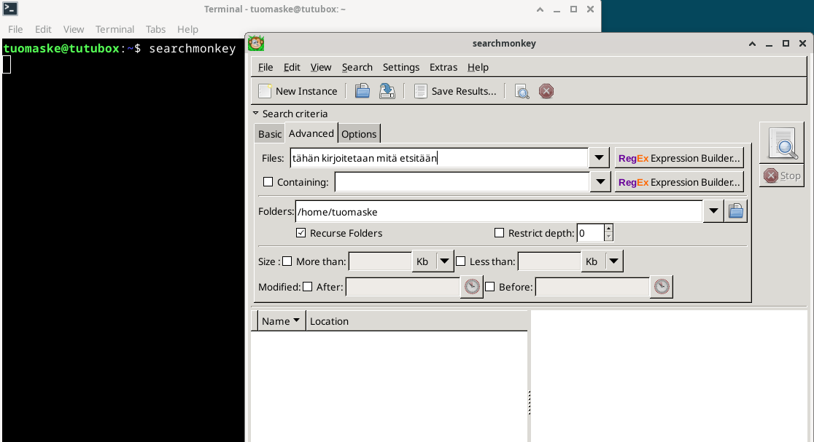

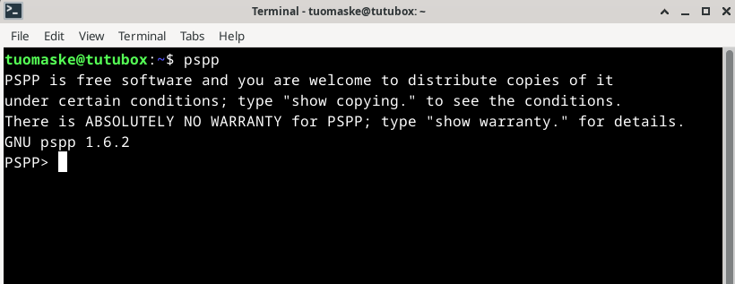

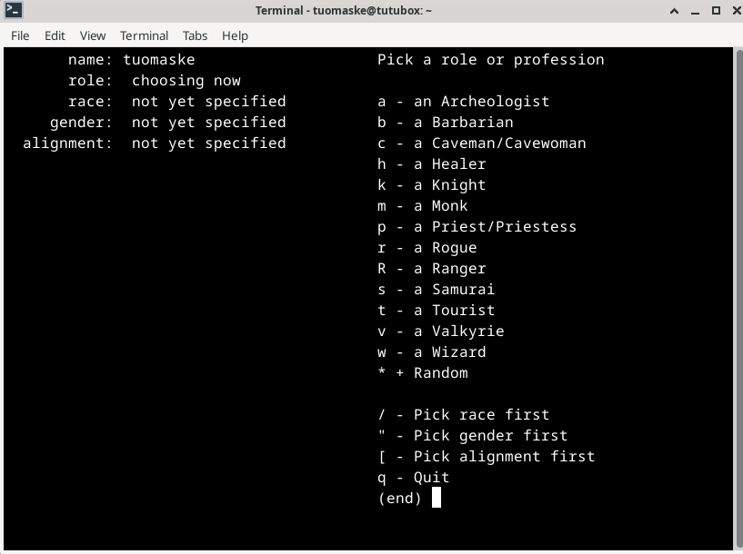

## c) 

Aluksi tarkastelin root-hakemistoa:

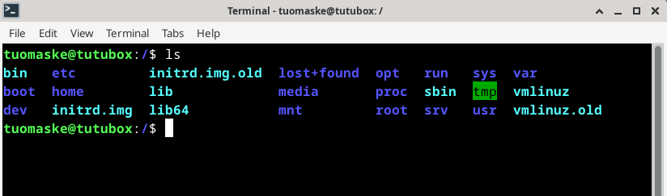

Tämän jälkeen siirryin Rootin alla olevaan etc hakemistoon, jossa säilötään koneen config-tiedostot. Alla esimerkki Netconfig-tiedostosta:

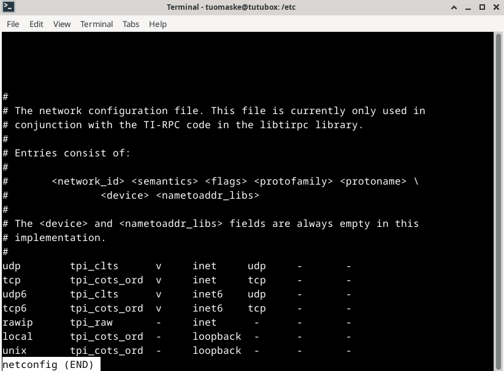

Seuraavaksi tarkastelin käyttäjähakemistoa, mihin tallennetaan kaikki käyttäjäkohtainen data:

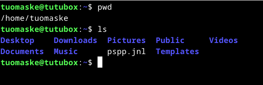

## d)

Grep-komennolla voi myös etsiä rekursiivisesti käyttämällä -r tarkennetta. Tämä etsii kohdetta tämänhetkisestä kansiosta ja kaikista kansioista sen sisällä. Havainnollistaakseni tätä toimintoa luon aluksi H2-kansion käyttäjähakemistooni ja sinne h2testi.md tiedoston, johon kirjoitin sanan "ananaskeitto".

    $ cd /home/tuomaske/
    $ mkdir H2
    $ cd H2
    $ micro h2testi.md

Seuraavaksi kokeilin löytääkö grep rekursiivisesti sanan "ananaskeitto" kun komento suoritetaan käyttäjähakemistossa /tuomaske/

    $ cd /home/tuomaske/
    $ grep -r ananaskeitto .

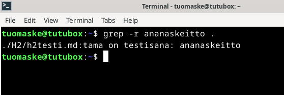

Tämän jälkeen testasin grepin laskemistoimintoa. Kävin kirjoittamassa aiemmin luotuun h2testi.md riveille 2-5 sanan "omena", ja sen jälkeen kokeilin osaako grep laskea "omena" sanan esiintymiskerrat kyseisessä tiedostossa.

    $ cd /home/tuomaske/H2/
    $ grep -c omena h2testi.md

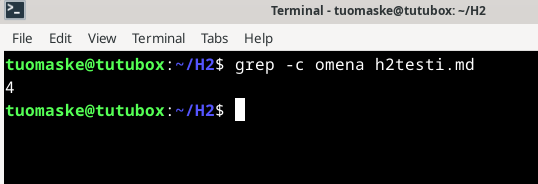

## e) 

Putkilla yhdistetään komennon yhden prosessin tuloste toisen prosessin syötteeksi. Esimerkiksi voin ottaa aiemman grep komennon ja esittää sen antaman tuloksen less-komennolla:

    $ cd /home/tuomaske/
    $grep -r ananaskeitto . | less

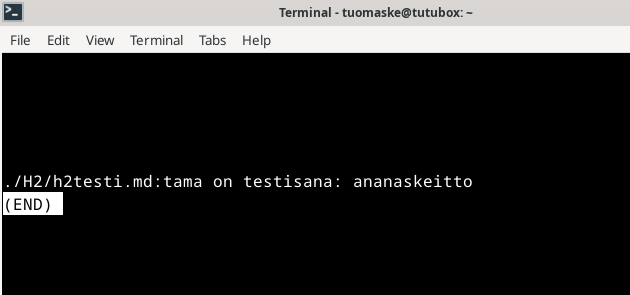

## f) 

Tässä tehtässä asensin list hardware -ohjelman (lshw) ja tarkastelin sen avulla koneeni "rautaa".

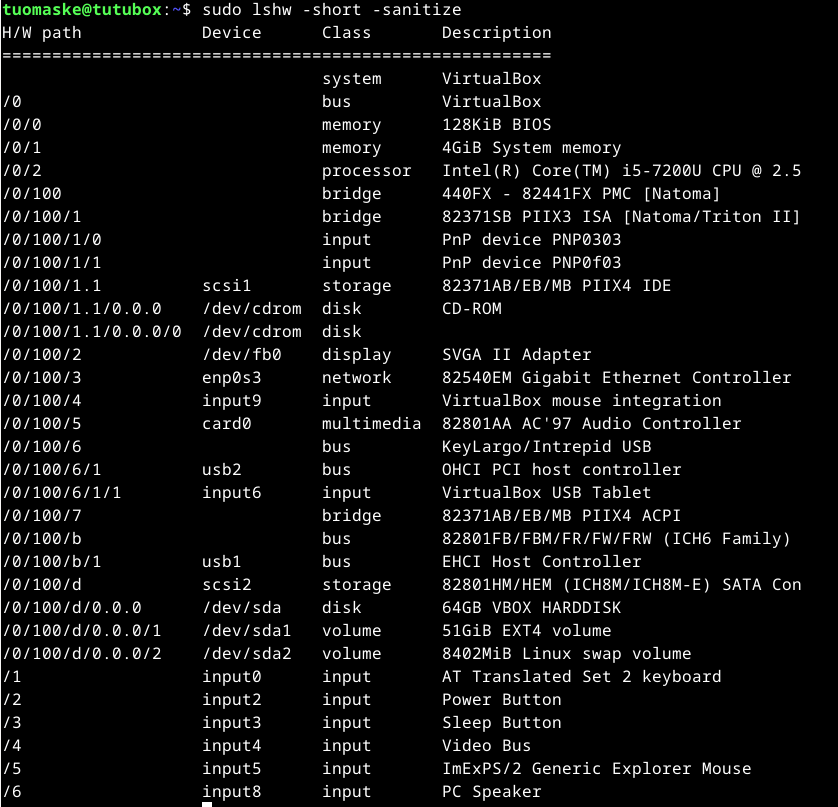

Luonnollisesti lshw näyttää luodun virtuaalikoneen laitteistoa eli "rautaa". Levyn ja työmuistin koko ovat vastaavat mitä asetettiin konetta luodessa. Prosessori on käytetyn isäntäkoneen. Eli komennolla saatiin selville ensisijaisesti se, että 1) ollaan virtuaalisella koneella 2) osa virtuaalisen koneen asetuksista.

## Lähteet 

1. https://terokarvinen.com/linux-palvelimet/
2. https://terokarvinen.com/2020/command-line-basics-revisited/?fromSearch=command%20line%20basics%20revisited

    
