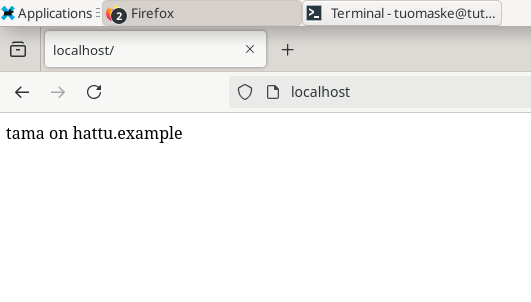
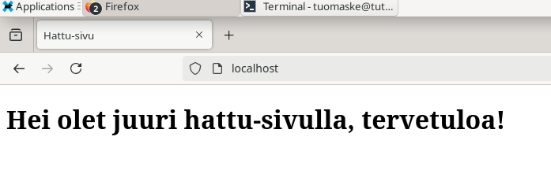

# H3 Hello Web Server

## a)

Testaan curl-komennolla, että saan yhteyden localhost-osoitteeseen. Tuloksena näkyy itse asettamani yksinkertainen testisivu, jonka tein harjoituksena tunnilla. Eli yhteys toimii.

## b)

Siirryin cd-komennolla /var/log hakemistoon ja sieltä ajoin komennon "sudo tail -f apache2/other_vhosts_access.log". Tällä näin viimeisen lokin joka syntyi aiemmasta curl-komennostani:

Tällä tulosteella osiot tarkoittavat seuraavaa:
 -  tutu.example.com on kohdepalvelimen hostname
 -  80 viittaa porttiin mitä kautta pyyntö kulkee. 80 on oletus HTTP-liikenteelle.
 -  127.0.0.1 on pyynnön lähtöosoite, tässä tapauksessa palvelimeni osoite.
 -  [03/Feb/2025:15:04:23 +0200] on aika milloin pyyntö tehtiin.
 -  "GET / HTTP/1.1" tämä on ajettu pyyntö.
 -  200 on HTTP statuskoodi ja tarkoittaa, että pyyntö onnistui.
 -  240 on vastauksen koko tavuissa.

## c)

Lähdin tekemään uutta aloitussivua komennolla

    $ sudoedit /etc/apache2/sites-available/hattu.example.com.conf

ja loin sivun sisällön komennolla:

    $ mkdir -p /home/tuomaske/publicsites/hattu.example.com
    $ echo tama on hattu.example > /home/tuomaske/publicsites/hattu.example.com/index.html

Tämän jälkeen lisäsin tämän uuden sivun saatavilla olevien sivujen listaan komennolla: 

    $ sudo a2ensite hattu.example.com

Ja poistin aiemman etusivun käytöstä komennolla:

    $ sudo a2dissite tutu.example.com

Molempien käskyjen yhteydessä boottasin demonin, koska tein siihen muutoksia: 

    $ sudo systemctl restart apache2

Kokeilin curl localhost -komennolla latautuuko etusivu, ei onnistunut (Statuskoodi 403). Kävin katsomassa apache2:n error.log, josta löysin relevantin virheilmoituksen: 

Virheilmoituksesta tunnistin, että siellä on väärä polku listattuna, joten menin tarkastamaan conf-tiedoston. Ja siellä oli kuin olikin jäänyt kirjoitusvirhe. Korjasin sen ja kokeilin uudelleen curl localhost, toimi. Lisäksi kokeilin selaimella: 

## e) 

Seuraavaksi kirjoitin yksinkertaisen html-koodin sivulle ja lisäsin sen index.html -tiedostoon, josta etusivu ladataan. Pystyin suoraan testaamaan tehtyjä muutoksia, koska muokkausoikeudet sallittiin aiemmin:

Tämän jälkeen kävin validoimassa kirjoittamani HTML5:n osoitteessa https://validator.w3.org/#validate_by_input. Ei ongelmia:

## f)

    $ curl localhost

    $ curl -I localhost 

Toisin kuin GET-pyyntö, HEAD-pyyntö (curl -I) pyytää palvelimelta vain kyseisen sivun otsikot. Saadussa tulosteessa näkyy mm. vastauksen statuskoodi (eli esim. onnistuiko pyyntö eli koodi 200), millaista sisältöä kohde on (esim. text/html) ja milloin viimeksi kohteen sisältöä on muokattu.

